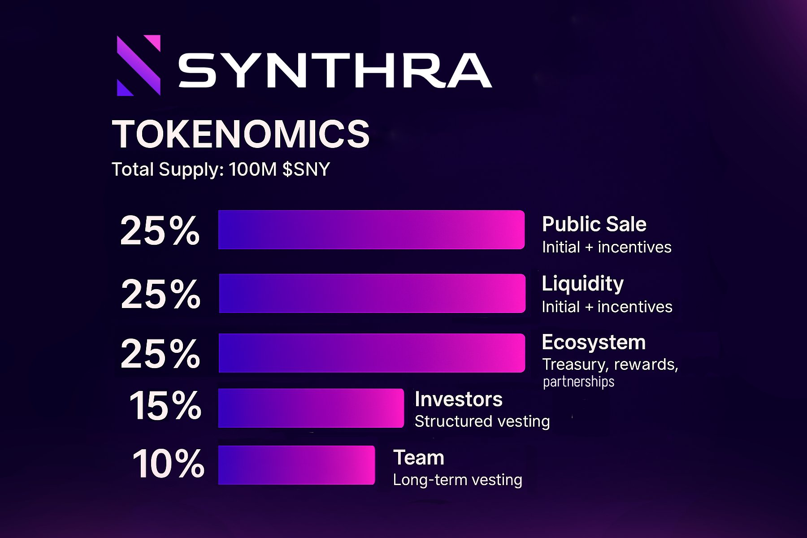

# Tokenomics

Synthra's tokenomics are designed to create sustainable value for all stakeholders through innovative mechanisms that align protocol success with token holder benefits.

<!-- ../images/tokenomics.jpeg -->

## Token Overview

### Basic Information

* **Token Name**: Synthra
* **Token Symbol**: £SYN
* **Total Supply**: 100,000,000 SYNTH (100M)
* **Decimals**: 18

### Supply Distribution

The total supply of 100M SYNTH tokens is allocated as follows:

| Allocation      | Amount | Percentage | Vesting                       | Purpose                                        |
| --------------- | ------ | ---------- | ----------------------------- | ---------------------------------------------- |
| **Public Sale** | 25M    | 25%        | No vesting                    | Fair public distribution and initial liquidity |
| **Liquidity**   | 25M    | 25%        | Immediate unlock              | DEX liquidity pools and market making          |
| **Ecosystem**   | 25M    | 25%        | 2-year gradual release        | Community incentives, partnerships, grants     |
| **Investors**   | 15M    | 15%        | 2-year vesting, 3-month cliff | Strategic investors and early backers          |
| **Team**        | 10M    | 10%        | 2-year vesting, 3-month cliff | Core team and advisors                         |

### Distribution Rationale

#### Public Sale (25%)

* **Fair Launch**: Maximum accessibility for retail participants
* **Price Discovery**: Market-driven token valuation
* **Community Building**: Broad token distribution from day one
* **Immediate Liquidity**: Supports trading and ecosystem growth

#### Liquidity (25%)

* **DEX Liquidity**: Ensures deep liquidity on launch
* **Market Stability**: Reduces price volatility
* **Trading Efficiency**: Enables large swaps with minimal slippage
* **Ecosystem Bootstrap**: Funds initial pool incentives

#### Ecosystem (25%)

* **Long-term Growth**: Funds sustainable ecosystem development
* **Community Incentives**: Rewards active participation
* **Partnership Development**: Strategic alliances and integrations
* **Grant Programs**: Supports developers building on Synthra

#### Investors (15%)

* **Strategic Capital**: Provides development funding
* **Industry Expertise**: Access to experienced advisors
* **Network Effects**: Leverages investor connections
* **Reduced Public Dilution**: Lower allocation than typical projects

#### Team (10%)

* **Talent Retention**: Competitive but conservative allocation
* **Long-term Alignment**: Extended vesting ensures commitment
* **Performance Incentives**: Success directly benefits team
* **Sustainable Development**: Funds ongoing protocol development

### Deflationary Mechanism

Synthra implements a **burn mechanism** through the treasury buyback program:

* **Regular Buybacks**: 60% of treasury funds used for token purchases
* **Immediate Burning**: All bought tokens permanently removed from circulation
* **Supply Reduction**: Estimated 2-5% annual burn rate at maturity
* **No New Emissions**: No additional tokens created after initial distribution

## Value Accrual Mechanisms

### 1. Treasury Fee Revenue (Primary)

**Revenue Source**: 33% of all trading fees across all pools

* Generates consistent buying pressure through buybacks
* Creates deflationary token economics
* Scales directly with protocol adoption and volume
* Provides sustainable funding without dilution

### 2. Staking Rewards (Future)

**Planned Implementation**: Additional utility through staking

* Share of treasury revenue distributed to stakers

## Economic Model

### Flywheel Effect

Synthra's tokenomics create multiple reinforcing loops:

**Volume Growth Loop**:\
Trading Volume → Treasury Fees → Buybacks → Token Value → More Liquidity → Higher Volume

**Network Loop**:\
Token Value → Developer Interest → More Integrations → Ecosystem Growth → Token Demand

### Sustainable Revenue Model

Unlike many DeFi protocols that rely on unsustainable token emissions:

#### Traditional Model Problems

* **High Inflation**: Dilutes existing holders
* **Sell Pressure**: Farmers dump rewards immediately
* **Unsustainable**: Cannot maintain high yields indefinitely
* **Misaligned Incentives**: Short-term thinking dominates

#### Synthra's Solution

* **Fee-Based Revenue**: Scales with actual protocol usage
* **Buyback Pressure**: Creates consistent buying demand
* **Deflationary Supply**: Reduces tokens over time
* **Long-term Alignment**: Success benefits all stakeholders

## Token Utility

### Future Utilities

#### Liquidity Mining Boosts

* **Enhanced Rewards**: Higher LP rewards for token holders
* **Multiplier System**: Token holdings boost farming yields
* **Long-term Incentives**: Encourage sustained participation
* **Compound Benefits**: Reinvestment amplifies returns

#### Premium Features

* **Advanced Analytics**: Detailed trading and LP performance data
* **Priority Support**: Enhanced customer service for holders
* **Early Access**: New features and pools before general release
* **API Access**: Developer tools for sophisticated strategies

***

Synthra's tokenomics create a sustainable foundation for long-term value creation, aligning incentives across all stakeholders while maintaining the decentralized and permissionless nature of DeFi.

### Vesting Schedule Details

#### Public Sale Tokens (25M SYNTH)

* **Unlock**: 100% at Token Generation Event (TGE)
* **Rationale**: Immediate tradability for fair price discovery
* **Impact**: Provides initial circulating supply for markets

#### Liquidity Tokens (25M SYNTH)

* **Unlock**: 100% at TGE
* **Allocation**: DEX pools, market making, initial liquidity
* **Management**: Protocol-controlled for optimal market efficiency

#### Ecosystem Tokens (25M SYNTH)

* **Cliff Period**: 5% at TGE
* **Cliff Period**: 3 months from TGE
* **Vesting**: 2-year linear vesting after cliff
* **Governance**: Community oversight of fund allocation

#### Investor Tokens (15M SYNTH)

* **Cliff Period**: 3 months from TGE
* **Vesting**: 2-year linear vesting after cliff
* **Lock-up**: Ensures aligned incentives with protocol success

#### Team Tokens (10M SYNTH)

* **Cliff Period**: 3 months from TGE
* **Vesting**: 2-year linear vesting after cliff
* **Performance**: Additional milestones may accelerate vesting

